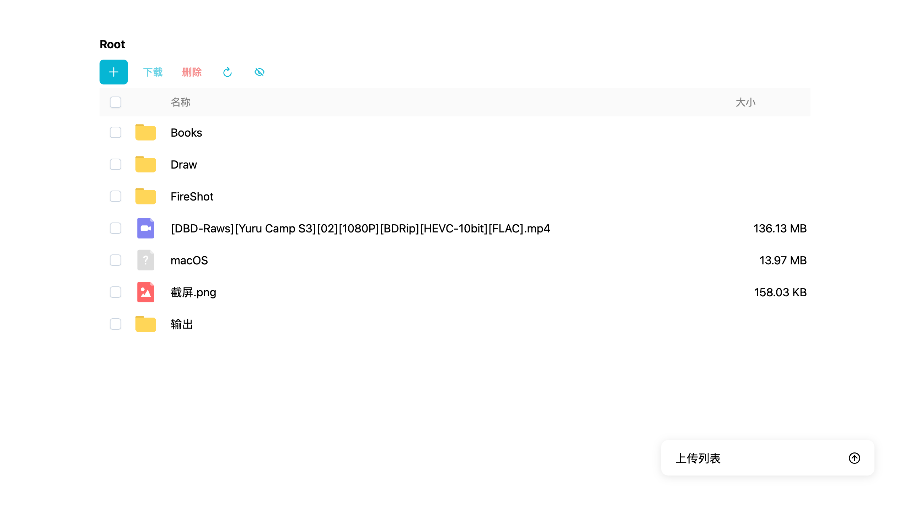
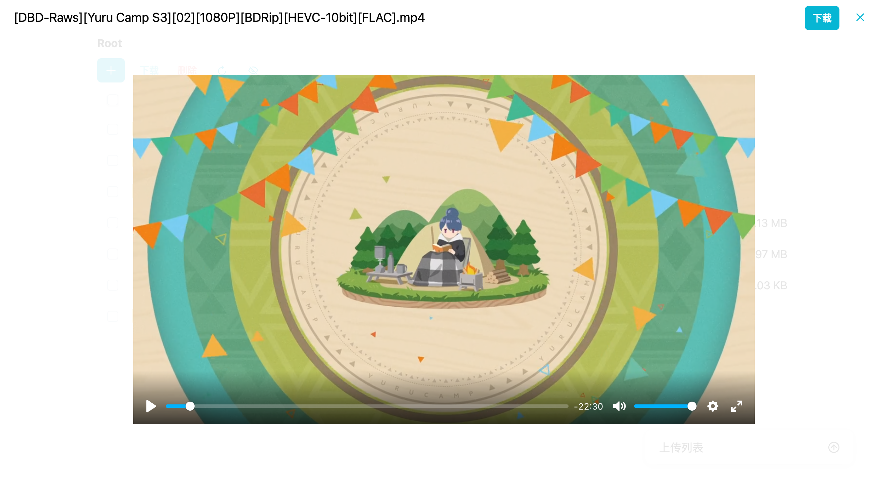

# Sharer (Core)

## Introduction


A file-sharing tool for PC/Mac that allows you to turn your computer into a file-sharing server.

> [!NOTE]
> You can use it [standalone](#usage), but it is highly recommended to use it with [Sharer-App](https://github.com/Zhoucheng133/Sharer-App).

✅ Packaged directory downloads  
✅ Multi-file downloads  
✅ Local directory uploading  
✅ Access control (Username & Password)  
✅ Online preview for common file formats  

## Table of Contents
- [Introduction](#introduction)
- [Table of Contents](#table-of-contents)
- [Screenshots](#screenshots)
- [Usage](#usage)
- [Build](#build)

## Screenshots





## Usage

1. Go to the **Releases** page and download the executable file compatible with your device.
2. If you are using **macOS**, you must run the following command after downloading to permit execution:
   ```bash
   chmod 777 <path-to-executable>
   ```
3. Run the program using the following command structure:
   ```bash
   <path-to-executable> -port <port-number> -d <directory-to-share> -u <username> -p <password>
   ```
4. After running the command, you will see a prompt like this:
   ```
   Server running at:
   ➜ [http://192.168.124.22:8081](http://192.168.124.22:8081)
   ➜ [http://127.0.0.1:8081](http://127.0.0.1:8081)
   ```

### Login with Username and Password

Example:

```bash
/Users/zhoucheng/Downloads/macOS -port 8081 -d /Users/zhoucheng/Downloads -u admin -p 123456
```

Port: `8081`  
Shared Directory: `/Users/zhoucheng/Downloads`  
Username: `admin`  
Password: `123456`

### No Username or Password Required for Login

Ignore the username and password fields. In this mode, all users on the local area network (LAN) can access the service directly without credentials. For example:

```bash
/Users/zhoucheng/Downloads/macOS -port 8081 -d /Users/zhoucheng/Downloads
```

Port: `8081`  
Shared Directory: `/Users/zhoucheng/Downloads`  

Note: The service will not run if you provide only a username or only a password.

## Build

### Prerequisites

Ensure the following tools are installed and configured on your device:
- bun
- go

### Generate Binary File

1. Clone or download this repository first.
2. Run this command in the repository to download submodules:
   ```bash
   git submodule update --init --recursive
   ```
3. Build the Web page
   ```bash
   cd Sharer-Web
   bun run build
   ```
4. Generate the binary
   ```bash
   cd .. # Return to the repository root
   go run . # Run the program
   go build # Build/Package
   ```

### Generate Dynamic Libraries for[Sharer-App](https://github.com/Zhoucheng133/Sharer-App) or Secondary Development

1. Clone or download this repository first.
2. Run this command in the repository to download submodules:
   ```bash
   git submodule update --init --recursive
   ```
3. Build the Web page
   ```bash
   cd Sharer-Web
   bun run build
   ```
4. Generate the dynamic library
   ```bash
   cd .. # Return to the repository root
   #  macOS
   go build -buildmode=c-shared -ldflags="-s -w" -o build/libserver.dylib
   # Windows
   go build -buildmode=c-shared -ldflags="-s -w" -o build/libserver.dll
   ```